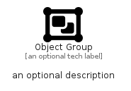

# ObjectGroup


```text
fontawesome/Solid/ObjectGroup
```

```text
include('fontawesome/Solid/ObjectGroup')
```


| Illustration | ObjectGroup |
| :---: | :---: |
|  |  |


## Sprites
The item provides the following sriptes:

- `<$ObjectGroupXs>`
- `<$ObjectGroupSm>`
- `<$ObjectGroupMd>`
- `<$ObjectGroupLg>`


## ObjectGroup

### Load remotely
```plantuml
@startuml
' configures the library
!global $LIB_BASE_LOCATION="https://raw.githubusercontent.com/tmorin/plantuml-libs/master/distribution"

' loads the library's bootstrap
!include $LIB_BASE_LOCATION/bootstrap.puml

' loads the package bootstrap
include('fontawesome/bootstrap')

' loads the Item which embeds the element ObjectGroup
include('fontawesome/Solid/ObjectGroup')

' renders the element
ObjectGroup('ObjectGroup', 'Object Group', 'an optional tech label', 'an optional description')
@enduml
```

### Load locally
```plantuml
@startuml
' configures the library
!global $INCLUSION_MODE="local"
!global $LIB_BASE_LOCATION="../.."

' loads the library's bootstrap
!include $LIB_BASE_LOCATION/bootstrap.puml

' loads the package bootstrap
include('fontawesome/bootstrap')

' loads the Item which embeds the element ObjectGroup
include('fontawesome/Solid/ObjectGroup')

' renders the element
ObjectGroup('ObjectGroup', 'Object Group', 'an optional tech label', 'an optional description')
@enduml
```

