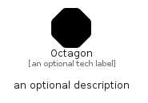

# Octagon


```text
fontawesome/Solid/Octagon
```

```text
include('fontawesome/Solid/Octagon')
```


| Illustration | Octagon |
| :---: | :---: |
|  |  |


## Sprites
The item provides the following sriptes:

- `<$OctagonXs>`
- `<$OctagonSm>`
- `<$OctagonMd>`
- `<$OctagonLg>`


## Octagon

### Load remotely
```plantuml
@startuml
' configures the library
!global $LIB_BASE_LOCATION="https://raw.githubusercontent.com/tmorin/plantuml-libs/master/distribution"

' loads the library's bootstrap
!include $LIB_BASE_LOCATION/bootstrap.puml

' loads the package bootstrap
include('fontawesome/bootstrap')

' loads the Item which embeds the element Octagon
include('fontawesome/Solid/Octagon')

' renders the element
Octagon('Octagon', 'Octagon', 'an optional tech label', 'an optional description')
@enduml
```

### Load locally
```plantuml
@startuml
' configures the library
!global $INCLUSION_MODE="local"
!global $LIB_BASE_LOCATION="../.."

' loads the library's bootstrap
!include $LIB_BASE_LOCATION/bootstrap.puml

' loads the package bootstrap
include('fontawesome/bootstrap')

' loads the Item which embeds the element Octagon
include('fontawesome/Solid/Octagon')

' renders the element
Octagon('Octagon', 'Octagon', 'an optional tech label', 'an optional description')
@enduml
```

