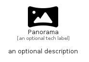

# Panorama


```text
fontawesome/Solid/Panorama
```

```text
include('fontawesome/Solid/Panorama')
```


| Illustration | Panorama |
| :---: | :---: |
|  |  |


## Sprites
The item provides the following sriptes:

- `<$PanoramaXs>`
- `<$PanoramaSm>`
- `<$PanoramaMd>`
- `<$PanoramaLg>`


## Panorama

### Load remotely
```plantuml
@startuml
' configures the library
!global $LIB_BASE_LOCATION="https://raw.githubusercontent.com/tmorin/plantuml-libs/master/distribution"

' loads the library's bootstrap
!include $LIB_BASE_LOCATION/bootstrap.puml

' loads the package bootstrap
include('fontawesome/bootstrap')

' loads the Item which embeds the element Panorama
include('fontawesome/Solid/Panorama')

' renders the element
Panorama('Panorama', 'Panorama', 'an optional tech label', 'an optional description')
@enduml
```

### Load locally
```plantuml
@startuml
' configures the library
!global $INCLUSION_MODE="local"
!global $LIB_BASE_LOCATION="../.."

' loads the library's bootstrap
!include $LIB_BASE_LOCATION/bootstrap.puml

' loads the package bootstrap
include('fontawesome/bootstrap')

' loads the Item which embeds the element Panorama
include('fontawesome/Solid/Panorama')

' renders the element
Panorama('Panorama', 'Panorama', 'an optional tech label', 'an optional description')
@enduml
```

