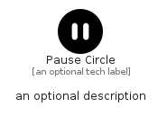

# PauseCircle


```text
fontawesome/Solid/PauseCircle
```

```text
include('fontawesome/Solid/PauseCircle')
```


| Illustration | PauseCircle |
| :---: | :---: |
|  |  |


## Sprites
The item provides the following sriptes:

- `<$PauseCircleXs>`
- `<$PauseCircleSm>`
- `<$PauseCircleMd>`
- `<$PauseCircleLg>`


## PauseCircle

### Load remotely
```plantuml
@startuml
' configures the library
!global $LIB_BASE_LOCATION="https://raw.githubusercontent.com/tmorin/plantuml-libs/master/distribution"

' loads the library's bootstrap
!include $LIB_BASE_LOCATION/bootstrap.puml

' loads the package bootstrap
include('fontawesome/bootstrap')

' loads the Item which embeds the element PauseCircle
include('fontawesome/Solid/PauseCircle')

' renders the element
PauseCircle('PauseCircle', 'Pause Circle', 'an optional tech label', 'an optional description')
@enduml
```

### Load locally
```plantuml
@startuml
' configures the library
!global $INCLUSION_MODE="local"
!global $LIB_BASE_LOCATION="../.."

' loads the library's bootstrap
!include $LIB_BASE_LOCATION/bootstrap.puml

' loads the package bootstrap
include('fontawesome/bootstrap')

' loads the Item which embeds the element PauseCircle
include('fontawesome/Solid/PauseCircle')

' renders the element
PauseCircle('PauseCircle', 'Pause Circle', 'an optional tech label', 'an optional description')
@enduml
```

