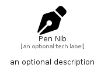

# PenNib


```text
fontawesome/Solid/PenNib
```

```text
include('fontawesome/Solid/PenNib')
```


| Illustration | PenNib |
| :---: | :---: |
|  |  |


## Sprites
The item provides the following sriptes:

- `<$PenNibXs>`
- `<$PenNibSm>`
- `<$PenNibMd>`
- `<$PenNibLg>`


## PenNib

### Load remotely
```plantuml
@startuml
' configures the library
!global $LIB_BASE_LOCATION="https://raw.githubusercontent.com/tmorin/plantuml-libs/master/distribution"

' loads the library's bootstrap
!include $LIB_BASE_LOCATION/bootstrap.puml

' loads the package bootstrap
include('fontawesome/bootstrap')

' loads the Item which embeds the element PenNib
include('fontawesome/Solid/PenNib')

' renders the element
PenNib('PenNib', 'Pen Nib', 'an optional tech label', 'an optional description')
@enduml
```

### Load locally
```plantuml
@startuml
' configures the library
!global $INCLUSION_MODE="local"
!global $LIB_BASE_LOCATION="../.."

' loads the library's bootstrap
!include $LIB_BASE_LOCATION/bootstrap.puml

' loads the package bootstrap
include('fontawesome/bootstrap')

' loads the Item which embeds the element PenNib
include('fontawesome/Solid/PenNib')

' renders the element
PenNib('PenNib', 'Pen Nib', 'an optional tech label', 'an optional description')
@enduml
```

