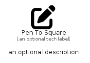

# PenToSquare


```text
fontawesome/Solid/PenToSquare
```

```text
include('fontawesome/Solid/PenToSquare')
```


| Illustration | PenToSquare |
| :---: | :---: |
|  |  |


## Sprites
The item provides the following sriptes:

- `<$PenToSquareXs>`
- `<$PenToSquareSm>`
- `<$PenToSquareMd>`
- `<$PenToSquareLg>`


## PenToSquare

### Load remotely
```plantuml
@startuml
' configures the library
!global $LIB_BASE_LOCATION="https://raw.githubusercontent.com/tmorin/plantuml-libs/master/distribution"

' loads the library's bootstrap
!include $LIB_BASE_LOCATION/bootstrap.puml

' loads the package bootstrap
include('fontawesome/bootstrap')

' loads the Item which embeds the element PenToSquare
include('fontawesome/Solid/PenToSquare')

' renders the element
PenToSquare('PenToSquare', 'Pen To Square', 'an optional tech label', 'an optional description')
@enduml
```

### Load locally
```plantuml
@startuml
' configures the library
!global $INCLUSION_MODE="local"
!global $LIB_BASE_LOCATION="../.."

' loads the library's bootstrap
!include $LIB_BASE_LOCATION/bootstrap.puml

' loads the package bootstrap
include('fontawesome/bootstrap')

' loads the Item which embeds the element PenToSquare
include('fontawesome/Solid/PenToSquare')

' renders the element
PenToSquare('PenToSquare', 'Pen To Square', 'an optional tech label', 'an optional description')
@enduml
```

