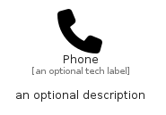

# Phone


```text
fontawesome/Solid/Phone
```

```text
include('fontawesome/Solid/Phone')
```


| Illustration | Phone |
| :---: | :---: |
|  |  |


## Sprites
The item provides the following sriptes:

- `<$PhoneXs>`
- `<$PhoneSm>`
- `<$PhoneMd>`
- `<$PhoneLg>`


## Phone

### Load remotely
```plantuml
@startuml
' configures the library
!global $LIB_BASE_LOCATION="https://raw.githubusercontent.com/tmorin/plantuml-libs/master/distribution"

' loads the library's bootstrap
!include $LIB_BASE_LOCATION/bootstrap.puml

' loads the package bootstrap
include('fontawesome/bootstrap')

' loads the Item which embeds the element Phone
include('fontawesome/Solid/Phone')

' renders the element
Phone('Phone', 'Phone', 'an optional tech label', 'an optional description')
@enduml
```

### Load locally
```plantuml
@startuml
' configures the library
!global $INCLUSION_MODE="local"
!global $LIB_BASE_LOCATION="../.."

' loads the library's bootstrap
!include $LIB_BASE_LOCATION/bootstrap.puml

' loads the package bootstrap
include('fontawesome/bootstrap')

' loads the Item which embeds the element Phone
include('fontawesome/Solid/Phone')

' renders the element
Phone('Phone', 'Phone', 'an optional tech label', 'an optional description')
@enduml
```

