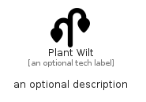

# PlantWilt


```text
fontawesome/Solid/PlantWilt
```

```text
include('fontawesome/Solid/PlantWilt')
```


| Illustration | PlantWilt |
| :---: | :---: |
|  |  |


## Sprites
The item provides the following sriptes:

- `<$PlantWiltXs>`
- `<$PlantWiltSm>`
- `<$PlantWiltMd>`
- `<$PlantWiltLg>`


## PlantWilt

### Load remotely
```plantuml
@startuml
' configures the library
!global $LIB_BASE_LOCATION="https://raw.githubusercontent.com/tmorin/plantuml-libs/master/distribution"

' loads the library's bootstrap
!include $LIB_BASE_LOCATION/bootstrap.puml

' loads the package bootstrap
include('fontawesome/bootstrap')

' loads the Item which embeds the element PlantWilt
include('fontawesome/Solid/PlantWilt')

' renders the element
PlantWilt('PlantWilt', 'Plant Wilt', 'an optional tech label', 'an optional description')
@enduml
```

### Load locally
```plantuml
@startuml
' configures the library
!global $INCLUSION_MODE="local"
!global $LIB_BASE_LOCATION="../.."

' loads the library's bootstrap
!include $LIB_BASE_LOCATION/bootstrap.puml

' loads the package bootstrap
include('fontawesome/bootstrap')

' loads the Item which embeds the element PlantWilt
include('fontawesome/Solid/PlantWilt')

' renders the element
PlantWilt('PlantWilt', 'Plant Wilt', 'an optional tech label', 'an optional description')
@enduml
```

