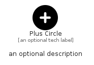

# PlusCircle


```text
fontawesome/Solid/PlusCircle
```

```text
include('fontawesome/Solid/PlusCircle')
```


| Illustration | PlusCircle |
| :---: | :---: |
|  |  |


## Sprites
The item provides the following sriptes:

- `<$PlusCircleXs>`
- `<$PlusCircleSm>`
- `<$PlusCircleMd>`
- `<$PlusCircleLg>`


## PlusCircle

### Load remotely
```plantuml
@startuml
' configures the library
!global $LIB_BASE_LOCATION="https://raw.githubusercontent.com/tmorin/plantuml-libs/master/distribution"

' loads the library's bootstrap
!include $LIB_BASE_LOCATION/bootstrap.puml

' loads the package bootstrap
include('fontawesome/bootstrap')

' loads the Item which embeds the element PlusCircle
include('fontawesome/Solid/PlusCircle')

' renders the element
PlusCircle('PlusCircle', 'Plus Circle', 'an optional tech label', 'an optional description')
@enduml
```

### Load locally
```plantuml
@startuml
' configures the library
!global $INCLUSION_MODE="local"
!global $LIB_BASE_LOCATION="../.."

' loads the library's bootstrap
!include $LIB_BASE_LOCATION/bootstrap.puml

' loads the package bootstrap
include('fontawesome/bootstrap')

' loads the Item which embeds the element PlusCircle
include('fontawesome/Solid/PlusCircle')

' renders the element
PlusCircle('PlusCircle', 'Plus Circle', 'an optional tech label', 'an optional description')
@enduml
```

