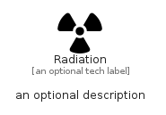

# Radiation


```text
fontawesome/Solid/Radiation
```

```text
include('fontawesome/Solid/Radiation')
```


| Illustration | Radiation |
| :---: | :---: |
|  |  |


## Sprites
The item provides the following sriptes:

- `<$RadiationXs>`
- `<$RadiationSm>`
- `<$RadiationMd>`
- `<$RadiationLg>`


## Radiation

### Load remotely
```plantuml
@startuml
' configures the library
!global $LIB_BASE_LOCATION="https://raw.githubusercontent.com/tmorin/plantuml-libs/master/distribution"

' loads the library's bootstrap
!include $LIB_BASE_LOCATION/bootstrap.puml

' loads the package bootstrap
include('fontawesome/bootstrap')

' loads the Item which embeds the element Radiation
include('fontawesome/Solid/Radiation')

' renders the element
Radiation('Radiation', 'Radiation', 'an optional tech label', 'an optional description')
@enduml
```

### Load locally
```plantuml
@startuml
' configures the library
!global $INCLUSION_MODE="local"
!global $LIB_BASE_LOCATION="../.."

' loads the library's bootstrap
!include $LIB_BASE_LOCATION/bootstrap.puml

' loads the package bootstrap
include('fontawesome/bootstrap')

' loads the Item which embeds the element Radiation
include('fontawesome/Solid/Radiation')

' renders the element
Radiation('Radiation', 'Radiation', 'an optional tech label', 'an optional description')
@enduml
```

