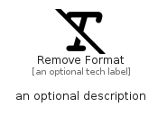

# RemoveFormat


```text
fontawesome/Solid/RemoveFormat
```

```text
include('fontawesome/Solid/RemoveFormat')
```


| Illustration | RemoveFormat |
| :---: | :---: |
|  |  |


## Sprites
The item provides the following sriptes:

- `<$RemoveFormatXs>`
- `<$RemoveFormatSm>`
- `<$RemoveFormatMd>`
- `<$RemoveFormatLg>`


## RemoveFormat

### Load remotely
```plantuml
@startuml
' configures the library
!global $LIB_BASE_LOCATION="https://raw.githubusercontent.com/tmorin/plantuml-libs/master/distribution"

' loads the library's bootstrap
!include $LIB_BASE_LOCATION/bootstrap.puml

' loads the package bootstrap
include('fontawesome/bootstrap')

' loads the Item which embeds the element RemoveFormat
include('fontawesome/Solid/RemoveFormat')

' renders the element
RemoveFormat('RemoveFormat', 'Remove Format', 'an optional tech label', 'an optional description')
@enduml
```

### Load locally
```plantuml
@startuml
' configures the library
!global $INCLUSION_MODE="local"
!global $LIB_BASE_LOCATION="../.."

' loads the library's bootstrap
!include $LIB_BASE_LOCATION/bootstrap.puml

' loads the package bootstrap
include('fontawesome/bootstrap')

' loads the Item which embeds the element RemoveFormat
include('fontawesome/Solid/RemoveFormat')

' renders the element
RemoveFormat('RemoveFormat', 'Remove Format', 'an optional tech label', 'an optional description')
@enduml
```

