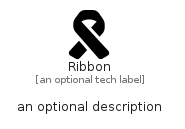

# Ribbon


```text
fontawesome/Solid/Ribbon
```

```text
include('fontawesome/Solid/Ribbon')
```


| Illustration | Ribbon |
| :---: | :---: |
|  |  |


## Sprites
The item provides the following sriptes:

- `<$RibbonXs>`
- `<$RibbonSm>`
- `<$RibbonMd>`
- `<$RibbonLg>`


## Ribbon

### Load remotely
```plantuml
@startuml
' configures the library
!global $LIB_BASE_LOCATION="https://raw.githubusercontent.com/tmorin/plantuml-libs/master/distribution"

' loads the library's bootstrap
!include $LIB_BASE_LOCATION/bootstrap.puml

' loads the package bootstrap
include('fontawesome/bootstrap')

' loads the Item which embeds the element Ribbon
include('fontawesome/Solid/Ribbon')

' renders the element
Ribbon('Ribbon', 'Ribbon', 'an optional tech label', 'an optional description')
@enduml
```

### Load locally
```plantuml
@startuml
' configures the library
!global $INCLUSION_MODE="local"
!global $LIB_BASE_LOCATION="../.."

' loads the library's bootstrap
!include $LIB_BASE_LOCATION/bootstrap.puml

' loads the package bootstrap
include('fontawesome/bootstrap')

' loads the Item which embeds the element Ribbon
include('fontawesome/Solid/Ribbon')

' renders the element
Ribbon('Ribbon', 'Ribbon', 'an optional tech label', 'an optional description')
@enduml
```

