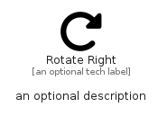

# RotateRight


```text
fontawesome/Solid/RotateRight
```

```text
include('fontawesome/Solid/RotateRight')
```


| Illustration | RotateRight |
| :---: | :---: |
|  |  |


## Sprites
The item provides the following sriptes:

- `<$RotateRightXs>`
- `<$RotateRightSm>`
- `<$RotateRightMd>`
- `<$RotateRightLg>`


## RotateRight

### Load remotely
```plantuml
@startuml
' configures the library
!global $LIB_BASE_LOCATION="https://raw.githubusercontent.com/tmorin/plantuml-libs/master/distribution"

' loads the library's bootstrap
!include $LIB_BASE_LOCATION/bootstrap.puml

' loads the package bootstrap
include('fontawesome/bootstrap')

' loads the Item which embeds the element RotateRight
include('fontawesome/Solid/RotateRight')

' renders the element
RotateRight('RotateRight', 'Rotate Right', 'an optional tech label', 'an optional description')
@enduml
```

### Load locally
```plantuml
@startuml
' configures the library
!global $INCLUSION_MODE="local"
!global $LIB_BASE_LOCATION="../.."

' loads the library's bootstrap
!include $LIB_BASE_LOCATION/bootstrap.puml

' loads the package bootstrap
include('fontawesome/bootstrap')

' loads the Item which embeds the element RotateRight
include('fontawesome/Solid/RotateRight')

' renders the element
RotateRight('RotateRight', 'Rotate Right', 'an optional tech label', 'an optional description')
@enduml
```

