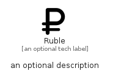

# Ruble


```text
fontawesome/Solid/Ruble
```

```text
include('fontawesome/Solid/Ruble')
```


| Illustration | Ruble |
| :---: | :---: |
|  |  |


## Sprites
The item provides the following sriptes:

- `<$RubleXs>`
- `<$RubleSm>`
- `<$RubleMd>`
- `<$RubleLg>`


## Ruble

### Load remotely
```plantuml
@startuml
' configures the library
!global $LIB_BASE_LOCATION="https://raw.githubusercontent.com/tmorin/plantuml-libs/master/distribution"

' loads the library's bootstrap
!include $LIB_BASE_LOCATION/bootstrap.puml

' loads the package bootstrap
include('fontawesome/bootstrap')

' loads the Item which embeds the element Ruble
include('fontawesome/Solid/Ruble')

' renders the element
Ruble('Ruble', 'Ruble', 'an optional tech label', 'an optional description')
@enduml
```

### Load locally
```plantuml
@startuml
' configures the library
!global $INCLUSION_MODE="local"
!global $LIB_BASE_LOCATION="../.."

' loads the library's bootstrap
!include $LIB_BASE_LOCATION/bootstrap.puml

' loads the package bootstrap
include('fontawesome/bootstrap')

' loads the Item which embeds the element Ruble
include('fontawesome/Solid/Ruble')

' renders the element
Ruble('Ruble', 'Ruble', 'an optional tech label', 'an optional description')
@enduml
```

