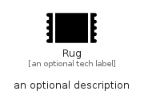

# Rug


```text
fontawesome/Solid/Rug
```

```text
include('fontawesome/Solid/Rug')
```


| Illustration | Rug |
| :---: | :---: |
|  |  |


## Sprites
The item provides the following sriptes:

- `<$RugXs>`
- `<$RugSm>`
- `<$RugMd>`
- `<$RugLg>`


## Rug

### Load remotely
```plantuml
@startuml
' configures the library
!global $LIB_BASE_LOCATION="https://raw.githubusercontent.com/tmorin/plantuml-libs/master/distribution"

' loads the library's bootstrap
!include $LIB_BASE_LOCATION/bootstrap.puml

' loads the package bootstrap
include('fontawesome/bootstrap')

' loads the Item which embeds the element Rug
include('fontawesome/Solid/Rug')

' renders the element
Rug('Rug', 'Rug', 'an optional tech label', 'an optional description')
@enduml
```

### Load locally
```plantuml
@startuml
' configures the library
!global $INCLUSION_MODE="local"
!global $LIB_BASE_LOCATION="../.."

' loads the library's bootstrap
!include $LIB_BASE_LOCATION/bootstrap.puml

' loads the package bootstrap
include('fontawesome/bootstrap')

' loads the Item which embeds the element Rug
include('fontawesome/Solid/Rug')

' renders the element
Rug('Rug', 'Rug', 'an optional tech label', 'an optional description')
@enduml
```

