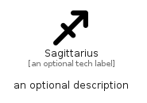

# Sagittarius


```text
fontawesome/Solid/Sagittarius
```

```text
include('fontawesome/Solid/Sagittarius')
```


| Illustration | Sagittarius |
| :---: | :---: |
|  |  |


## Sprites
The item provides the following sriptes:

- `<$SagittariusXs>`
- `<$SagittariusSm>`
- `<$SagittariusMd>`
- `<$SagittariusLg>`


## Sagittarius

### Load remotely
```plantuml
@startuml
' configures the library
!global $LIB_BASE_LOCATION="https://raw.githubusercontent.com/tmorin/plantuml-libs/master/distribution"

' loads the library's bootstrap
!include $LIB_BASE_LOCATION/bootstrap.puml

' loads the package bootstrap
include('fontawesome/bootstrap')

' loads the Item which embeds the element Sagittarius
include('fontawesome/Solid/Sagittarius')

' renders the element
Sagittarius('Sagittarius', 'Sagittarius', 'an optional tech label', 'an optional description')
@enduml
```

### Load locally
```plantuml
@startuml
' configures the library
!global $INCLUSION_MODE="local"
!global $LIB_BASE_LOCATION="../.."

' loads the library's bootstrap
!include $LIB_BASE_LOCATION/bootstrap.puml

' loads the package bootstrap
include('fontawesome/bootstrap')

' loads the Item which embeds the element Sagittarius
include('fontawesome/Solid/Sagittarius')

' renders the element
Sagittarius('Sagittarius', 'Sagittarius', 'an optional tech label', 'an optional description')
@enduml
```

