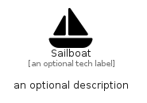

# Sailboat


```text
fontawesome/Solid/Sailboat
```

```text
include('fontawesome/Solid/Sailboat')
```


| Illustration | Sailboat |
| :---: | :---: |
|  |  |


## Sprites
The item provides the following sriptes:

- `<$SailboatXs>`
- `<$SailboatSm>`
- `<$SailboatMd>`
- `<$SailboatLg>`


## Sailboat

### Load remotely
```plantuml
@startuml
' configures the library
!global $LIB_BASE_LOCATION="https://raw.githubusercontent.com/tmorin/plantuml-libs/master/distribution"

' loads the library's bootstrap
!include $LIB_BASE_LOCATION/bootstrap.puml

' loads the package bootstrap
include('fontawesome/bootstrap')

' loads the Item which embeds the element Sailboat
include('fontawesome/Solid/Sailboat')

' renders the element
Sailboat('Sailboat', 'Sailboat', 'an optional tech label', 'an optional description')
@enduml
```

### Load locally
```plantuml
@startuml
' configures the library
!global $INCLUSION_MODE="local"
!global $LIB_BASE_LOCATION="../.."

' loads the library's bootstrap
!include $LIB_BASE_LOCATION/bootstrap.puml

' loads the package bootstrap
include('fontawesome/bootstrap')

' loads the Item which embeds the element Sailboat
include('fontawesome/Solid/Sailboat')

' renders the element
Sailboat('Sailboat', 'Sailboat', 'an optional tech label', 'an optional description')
@enduml
```

