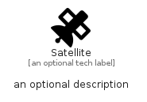

# Satellite


```text
fontawesome/Solid/Satellite
```

```text
include('fontawesome/Solid/Satellite')
```


| Illustration | Satellite |
| :---: | :---: |
|  |  |


## Sprites
The item provides the following sriptes:

- `<$SatelliteXs>`
- `<$SatelliteSm>`
- `<$SatelliteMd>`
- `<$SatelliteLg>`


## Satellite

### Load remotely
```plantuml
@startuml
' configures the library
!global $LIB_BASE_LOCATION="https://raw.githubusercontent.com/tmorin/plantuml-libs/master/distribution"

' loads the library's bootstrap
!include $LIB_BASE_LOCATION/bootstrap.puml

' loads the package bootstrap
include('fontawesome/bootstrap')

' loads the Item which embeds the element Satellite
include('fontawesome/Solid/Satellite')

' renders the element
Satellite('Satellite', 'Satellite', 'an optional tech label', 'an optional description')
@enduml
```

### Load locally
```plantuml
@startuml
' configures the library
!global $INCLUSION_MODE="local"
!global $LIB_BASE_LOCATION="../.."

' loads the library's bootstrap
!include $LIB_BASE_LOCATION/bootstrap.puml

' loads the package bootstrap
include('fontawesome/bootstrap')

' loads the Item which embeds the element Satellite
include('fontawesome/Solid/Satellite')

' renders the element
Satellite('Satellite', 'Satellite', 'an optional tech label', 'an optional description')
@enduml
```

