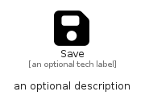

# Save


```text
fontawesome/Solid/Save
```

```text
include('fontawesome/Solid/Save')
```


| Illustration | Save |
| :---: | :---: |
|  |  |


## Sprites
The item provides the following sriptes:

- `<$SaveXs>`
- `<$SaveSm>`
- `<$SaveMd>`
- `<$SaveLg>`


## Save

### Load remotely
```plantuml
@startuml
' configures the library
!global $LIB_BASE_LOCATION="https://raw.githubusercontent.com/tmorin/plantuml-libs/master/distribution"

' loads the library's bootstrap
!include $LIB_BASE_LOCATION/bootstrap.puml

' loads the package bootstrap
include('fontawesome/bootstrap')

' loads the Item which embeds the element Save
include('fontawesome/Solid/Save')

' renders the element
Save('Save', 'Save', 'an optional tech label', 'an optional description')
@enduml
```

### Load locally
```plantuml
@startuml
' configures the library
!global $INCLUSION_MODE="local"
!global $LIB_BASE_LOCATION="../.."

' loads the library's bootstrap
!include $LIB_BASE_LOCATION/bootstrap.puml

' loads the package bootstrap
include('fontawesome/bootstrap')

' loads the Item which embeds the element Save
include('fontawesome/Solid/Save')

' renders the element
Save('Save', 'Save', 'an optional tech label', 'an optional description')
@enduml
```

