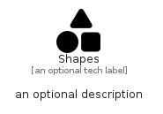

# Shapes


```text
fontawesome/Solid/Shapes
```

```text
include('fontawesome/Solid/Shapes')
```


| Illustration | Shapes |
| :---: | :---: |
|  |  |


## Sprites
The item provides the following sriptes:

- `<$ShapesXs>`
- `<$ShapesSm>`
- `<$ShapesMd>`
- `<$ShapesLg>`


## Shapes

### Load remotely
```plantuml
@startuml
' configures the library
!global $LIB_BASE_LOCATION="https://raw.githubusercontent.com/tmorin/plantuml-libs/master/distribution"

' loads the library's bootstrap
!include $LIB_BASE_LOCATION/bootstrap.puml

' loads the package bootstrap
include('fontawesome/bootstrap')

' loads the Item which embeds the element Shapes
include('fontawesome/Solid/Shapes')

' renders the element
Shapes('Shapes', 'Shapes', 'an optional tech label', 'an optional description')
@enduml
```

### Load locally
```plantuml
@startuml
' configures the library
!global $INCLUSION_MODE="local"
!global $LIB_BASE_LOCATION="../.."

' loads the library's bootstrap
!include $LIB_BASE_LOCATION/bootstrap.puml

' loads the package bootstrap
include('fontawesome/bootstrap')

' loads the Item which embeds the element Shapes
include('fontawesome/Solid/Shapes')

' renders the element
Shapes('Shapes', 'Shapes', 'an optional tech label', 'an optional description')
@enduml
```

