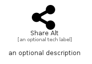

# ShareAlt


```text
fontawesome/Solid/ShareAlt
```

```text
include('fontawesome/Solid/ShareAlt')
```


| Illustration | ShareAlt |
| :---: | :---: |
|  |  |


## Sprites
The item provides the following sriptes:

- `<$ShareAltXs>`
- `<$ShareAltSm>`
- `<$ShareAltMd>`
- `<$ShareAltLg>`


## ShareAlt

### Load remotely
```plantuml
@startuml
' configures the library
!global $LIB_BASE_LOCATION="https://raw.githubusercontent.com/tmorin/plantuml-libs/master/distribution"

' loads the library's bootstrap
!include $LIB_BASE_LOCATION/bootstrap.puml

' loads the package bootstrap
include('fontawesome/bootstrap')

' loads the Item which embeds the element ShareAlt
include('fontawesome/Solid/ShareAlt')

' renders the element
ShareAlt('ShareAlt', 'Share Alt', 'an optional tech label', 'an optional description')
@enduml
```

### Load locally
```plantuml
@startuml
' configures the library
!global $INCLUSION_MODE="local"
!global $LIB_BASE_LOCATION="../.."

' loads the library's bootstrap
!include $LIB_BASE_LOCATION/bootstrap.puml

' loads the package bootstrap
include('fontawesome/bootstrap')

' loads the Item which embeds the element ShareAlt
include('fontawesome/Solid/ShareAlt')

' renders the element
ShareAlt('ShareAlt', 'Share Alt', 'an optional tech label', 'an optional description')
@enduml
```

