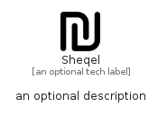

# Sheqel


```text
fontawesome/Solid/Sheqel
```

```text
include('fontawesome/Solid/Sheqel')
```


| Illustration | Sheqel |
| :---: | :---: |
|  |  |


## Sprites
The item provides the following sriptes:

- `<$SheqelXs>`
- `<$SheqelSm>`
- `<$SheqelMd>`
- `<$SheqelLg>`


## Sheqel

### Load remotely
```plantuml
@startuml
' configures the library
!global $LIB_BASE_LOCATION="https://raw.githubusercontent.com/tmorin/plantuml-libs/master/distribution"

' loads the library's bootstrap
!include $LIB_BASE_LOCATION/bootstrap.puml

' loads the package bootstrap
include('fontawesome/bootstrap')

' loads the Item which embeds the element Sheqel
include('fontawesome/Solid/Sheqel')

' renders the element
Sheqel('Sheqel', 'Sheqel', 'an optional tech label', 'an optional description')
@enduml
```

### Load locally
```plantuml
@startuml
' configures the library
!global $INCLUSION_MODE="local"
!global $LIB_BASE_LOCATION="../.."

' loads the library's bootstrap
!include $LIB_BASE_LOCATION/bootstrap.puml

' loads the package bootstrap
include('fontawesome/bootstrap')

' loads the Item which embeds the element Sheqel
include('fontawesome/Solid/Sheqel')

' renders the element
Sheqel('Sheqel', 'Sheqel', 'an optional tech label', 'an optional description')
@enduml
```

