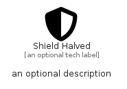

# ShieldHalved


```text
fontawesome/Solid/ShieldHalved
```

```text
include('fontawesome/Solid/ShieldHalved')
```


| Illustration | ShieldHalved |
| :---: | :---: |
|  |  |


## Sprites
The item provides the following sriptes:

- `<$ShieldHalvedXs>`
- `<$ShieldHalvedSm>`
- `<$ShieldHalvedMd>`
- `<$ShieldHalvedLg>`


## ShieldHalved

### Load remotely
```plantuml
@startuml
' configures the library
!global $LIB_BASE_LOCATION="https://raw.githubusercontent.com/tmorin/plantuml-libs/master/distribution"

' loads the library's bootstrap
!include $LIB_BASE_LOCATION/bootstrap.puml

' loads the package bootstrap
include('fontawesome/bootstrap')

' loads the Item which embeds the element ShieldHalved
include('fontawesome/Solid/ShieldHalved')

' renders the element
ShieldHalved('ShieldHalved', 'Shield Halved', 'an optional tech label', 'an optional description')
@enduml
```

### Load locally
```plantuml
@startuml
' configures the library
!global $INCLUSION_MODE="local"
!global $LIB_BASE_LOCATION="../.."

' loads the library's bootstrap
!include $LIB_BASE_LOCATION/bootstrap.puml

' loads the package bootstrap
include('fontawesome/bootstrap')

' loads the Item which embeds the element ShieldHalved
include('fontawesome/Solid/ShieldHalved')

' renders the element
ShieldHalved('ShieldHalved', 'Shield Halved', 'an optional tech label', 'an optional description')
@enduml
```

