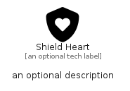

# ShieldHeart


```text
fontawesome/Solid/ShieldHeart
```

```text
include('fontawesome/Solid/ShieldHeart')
```


| Illustration | ShieldHeart |
| :---: | :---: |
|  |  |


## Sprites
The item provides the following sriptes:

- `<$ShieldHeartXs>`
- `<$ShieldHeartSm>`
- `<$ShieldHeartMd>`
- `<$ShieldHeartLg>`


## ShieldHeart

### Load remotely
```plantuml
@startuml
' configures the library
!global $LIB_BASE_LOCATION="https://raw.githubusercontent.com/tmorin/plantuml-libs/master/distribution"

' loads the library's bootstrap
!include $LIB_BASE_LOCATION/bootstrap.puml

' loads the package bootstrap
include('fontawesome/bootstrap')

' loads the Item which embeds the element ShieldHeart
include('fontawesome/Solid/ShieldHeart')

' renders the element
ShieldHeart('ShieldHeart', 'Shield Heart', 'an optional tech label', 'an optional description')
@enduml
```

### Load locally
```plantuml
@startuml
' configures the library
!global $INCLUSION_MODE="local"
!global $LIB_BASE_LOCATION="../.."

' loads the library's bootstrap
!include $LIB_BASE_LOCATION/bootstrap.puml

' loads the package bootstrap
include('fontawesome/bootstrap')

' loads the Item which embeds the element ShieldHeart
include('fontawesome/Solid/ShieldHeart')

' renders the element
ShieldHeart('ShieldHeart', 'Shield Heart', 'an optional tech label', 'an optional description')
@enduml
```

