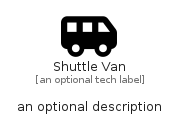

# ShuttleVan


```text
fontawesome/Solid/ShuttleVan
```

```text
include('fontawesome/Solid/ShuttleVan')
```


| Illustration | ShuttleVan |
| :---: | :---: |
|  |  |


## Sprites
The item provides the following sriptes:

- `<$ShuttleVanXs>`
- `<$ShuttleVanSm>`
- `<$ShuttleVanMd>`
- `<$ShuttleVanLg>`


## ShuttleVan

### Load remotely
```plantuml
@startuml
' configures the library
!global $LIB_BASE_LOCATION="https://raw.githubusercontent.com/tmorin/plantuml-libs/master/distribution"

' loads the library's bootstrap
!include $LIB_BASE_LOCATION/bootstrap.puml

' loads the package bootstrap
include('fontawesome/bootstrap')

' loads the Item which embeds the element ShuttleVan
include('fontawesome/Solid/ShuttleVan')

' renders the element
ShuttleVan('ShuttleVan', 'Shuttle Van', 'an optional tech label', 'an optional description')
@enduml
```

### Load locally
```plantuml
@startuml
' configures the library
!global $INCLUSION_MODE="local"
!global $LIB_BASE_LOCATION="../.."

' loads the library's bootstrap
!include $LIB_BASE_LOCATION/bootstrap.puml

' loads the package bootstrap
include('fontawesome/bootstrap')

' loads the Item which embeds the element ShuttleVan
include('fontawesome/Solid/ShuttleVan')

' renders the element
ShuttleVan('ShuttleVan', 'Shuttle Van', 'an optional tech label', 'an optional description')
@enduml
```

