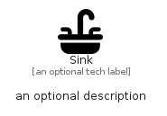

# Sink


```text
fontawesome/Solid/Sink
```

```text
include('fontawesome/Solid/Sink')
```


| Illustration | Sink |
| :---: | :---: |
|  |  |


## Sprites
The item provides the following sriptes:

- `<$SinkXs>`
- `<$SinkSm>`
- `<$SinkMd>`
- `<$SinkLg>`


## Sink

### Load remotely
```plantuml
@startuml
' configures the library
!global $LIB_BASE_LOCATION="https://raw.githubusercontent.com/tmorin/plantuml-libs/master/distribution"

' loads the library's bootstrap
!include $LIB_BASE_LOCATION/bootstrap.puml

' loads the package bootstrap
include('fontawesome/bootstrap')

' loads the Item which embeds the element Sink
include('fontawesome/Solid/Sink')

' renders the element
Sink('Sink', 'Sink', 'an optional tech label', 'an optional description')
@enduml
```

### Load locally
```plantuml
@startuml
' configures the library
!global $INCLUSION_MODE="local"
!global $LIB_BASE_LOCATION="../.."

' loads the library's bootstrap
!include $LIB_BASE_LOCATION/bootstrap.puml

' loads the package bootstrap
include('fontawesome/bootstrap')

' loads the Item which embeds the element Sink
include('fontawesome/Solid/Sink')

' renders the element
Sink('Sink', 'Sink', 'an optional tech label', 'an optional description')
@enduml
```

