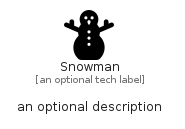

# Snowman


```text
fontawesome/Solid/Snowman
```

```text
include('fontawesome/Solid/Snowman')
```


| Illustration | Snowman |
| :---: | :---: |
|  |  |


## Sprites
The item provides the following sriptes:

- `<$SnowmanXs>`
- `<$SnowmanSm>`
- `<$SnowmanMd>`
- `<$SnowmanLg>`


## Snowman

### Load remotely
```plantuml
@startuml
' configures the library
!global $LIB_BASE_LOCATION="https://raw.githubusercontent.com/tmorin/plantuml-libs/master/distribution"

' loads the library's bootstrap
!include $LIB_BASE_LOCATION/bootstrap.puml

' loads the package bootstrap
include('fontawesome/bootstrap')

' loads the Item which embeds the element Snowman
include('fontawesome/Solid/Snowman')

' renders the element
Snowman('Snowman', 'Snowman', 'an optional tech label', 'an optional description')
@enduml
```

### Load locally
```plantuml
@startuml
' configures the library
!global $INCLUSION_MODE="local"
!global $LIB_BASE_LOCATION="../.."

' loads the library's bootstrap
!include $LIB_BASE_LOCATION/bootstrap.puml

' loads the package bootstrap
include('fontawesome/bootstrap')

' loads the Item which embeds the element Snowman
include('fontawesome/Solid/Snowman')

' renders the element
Snowman('Snowman', 'Snowman', 'an optional tech label', 'an optional description')
@enduml
```

