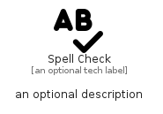

# SpellCheck


```text
fontawesome/Solid/SpellCheck
```

```text
include('fontawesome/Solid/SpellCheck')
```


| Illustration | SpellCheck |
| :---: | :---: |
|  |  |


## Sprites
The item provides the following sriptes:

- `<$SpellCheckXs>`
- `<$SpellCheckSm>`
- `<$SpellCheckMd>`
- `<$SpellCheckLg>`


## SpellCheck

### Load remotely
```plantuml
@startuml
' configures the library
!global $LIB_BASE_LOCATION="https://raw.githubusercontent.com/tmorin/plantuml-libs/master/distribution"

' loads the library's bootstrap
!include $LIB_BASE_LOCATION/bootstrap.puml

' loads the package bootstrap
include('fontawesome/bootstrap')

' loads the Item which embeds the element SpellCheck
include('fontawesome/Solid/SpellCheck')

' renders the element
SpellCheck('SpellCheck', 'Spell Check', 'an optional tech label', 'an optional description')
@enduml
```

### Load locally
```plantuml
@startuml
' configures the library
!global $INCLUSION_MODE="local"
!global $LIB_BASE_LOCATION="../.."

' loads the library's bootstrap
!include $LIB_BASE_LOCATION/bootstrap.puml

' loads the package bootstrap
include('fontawesome/bootstrap')

' loads the Item which embeds the element SpellCheck
include('fontawesome/Solid/SpellCheck')

' renders the element
SpellCheck('SpellCheck', 'Spell Check', 'an optional tech label', 'an optional description')
@enduml
```

