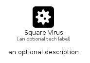

# SquareVirus


```text
fontawesome/Solid/SquareVirus
```

```text
include('fontawesome/Solid/SquareVirus')
```


| Illustration | SquareVirus |
| :---: | :---: |
|  |  |


## Sprites
The item provides the following sriptes:

- `<$SquareVirusXs>`
- `<$SquareVirusSm>`
- `<$SquareVirusMd>`
- `<$SquareVirusLg>`


## SquareVirus

### Load remotely
```plantuml
@startuml
' configures the library
!global $LIB_BASE_LOCATION="https://raw.githubusercontent.com/tmorin/plantuml-libs/master/distribution"

' loads the library's bootstrap
!include $LIB_BASE_LOCATION/bootstrap.puml

' loads the package bootstrap
include('fontawesome/bootstrap')

' loads the Item which embeds the element SquareVirus
include('fontawesome/Solid/SquareVirus')

' renders the element
SquareVirus('SquareVirus', 'Square Virus', 'an optional tech label', 'an optional description')
@enduml
```

### Load locally
```plantuml
@startuml
' configures the library
!global $INCLUSION_MODE="local"
!global $LIB_BASE_LOCATION="../.."

' loads the library's bootstrap
!include $LIB_BASE_LOCATION/bootstrap.puml

' loads the package bootstrap
include('fontawesome/bootstrap')

' loads the Item which embeds the element SquareVirus
include('fontawesome/Solid/SquareVirus')

' renders the element
SquareVirus('SquareVirus', 'Square Virus', 'an optional tech label', 'an optional description')
@enduml
```

