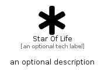

# StarOfLife


```text
fontawesome/Solid/StarOfLife
```

```text
include('fontawesome/Solid/StarOfLife')
```


| Illustration | StarOfLife |
| :---: | :---: |
|  |  |


## Sprites
The item provides the following sriptes:

- `<$StarOfLifeXs>`
- `<$StarOfLifeSm>`
- `<$StarOfLifeMd>`
- `<$StarOfLifeLg>`


## StarOfLife

### Load remotely
```plantuml
@startuml
' configures the library
!global $LIB_BASE_LOCATION="https://raw.githubusercontent.com/tmorin/plantuml-libs/master/distribution"

' loads the library's bootstrap
!include $LIB_BASE_LOCATION/bootstrap.puml

' loads the package bootstrap
include('fontawesome/bootstrap')

' loads the Item which embeds the element StarOfLife
include('fontawesome/Solid/StarOfLife')

' renders the element
StarOfLife('StarOfLife', 'Star Of Life', 'an optional tech label', 'an optional description')
@enduml
```

### Load locally
```plantuml
@startuml
' configures the library
!global $INCLUSION_MODE="local"
!global $LIB_BASE_LOCATION="../.."

' loads the library's bootstrap
!include $LIB_BASE_LOCATION/bootstrap.puml

' loads the package bootstrap
include('fontawesome/bootstrap')

' loads the Item which embeds the element StarOfLife
include('fontawesome/Solid/StarOfLife')

' renders the element
StarOfLife('StarOfLife', 'Star Of Life', 'an optional tech label', 'an optional description')
@enduml
```

