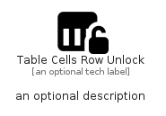

# TableCellsRowUnlock


```text
fontawesome/Solid/TableCellsRowUnlock
```

```text
include('fontawesome/Solid/TableCellsRowUnlock')
```


| Illustration | TableCellsRowUnlock |
| :---: | :---: |
|  |  |


## Sprites
The item provides the following sriptes:

- `<$TableCellsRowUnlockXs>`
- `<$TableCellsRowUnlockSm>`
- `<$TableCellsRowUnlockMd>`
- `<$TableCellsRowUnlockLg>`


## TableCellsRowUnlock

### Load remotely
```plantuml
@startuml
' configures the library
!global $LIB_BASE_LOCATION="https://raw.githubusercontent.com/tmorin/plantuml-libs/master/distribution"

' loads the library's bootstrap
!include $LIB_BASE_LOCATION/bootstrap.puml

' loads the package bootstrap
include('fontawesome/bootstrap')

' loads the Item which embeds the element TableCellsRowUnlock
include('fontawesome/Solid/TableCellsRowUnlock')

' renders the element
TableCellsRowUnlock('TableCellsRowUnlock', 'Table Cells Row Unlock', 'an optional tech label', 'an optional description')
@enduml
```

### Load locally
```plantuml
@startuml
' configures the library
!global $INCLUSION_MODE="local"
!global $LIB_BASE_LOCATION="../.."

' loads the library's bootstrap
!include $LIB_BASE_LOCATION/bootstrap.puml

' loads the package bootstrap
include('fontawesome/bootstrap')

' loads the Item which embeds the element TableCellsRowUnlock
include('fontawesome/Solid/TableCellsRowUnlock')

' renders the element
TableCellsRowUnlock('TableCellsRowUnlock', 'Table Cells Row Unlock', 'an optional tech label', 'an optional description')
@enduml
```

