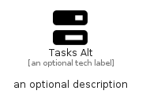

# TasksAlt


```text
fontawesome/Solid/TasksAlt
```

```text
include('fontawesome/Solid/TasksAlt')
```


| Illustration | TasksAlt |
| :---: | :---: |
|  |  |


## Sprites
The item provides the following sriptes:

- `<$TasksAltXs>`
- `<$TasksAltSm>`
- `<$TasksAltMd>`
- `<$TasksAltLg>`


## TasksAlt

### Load remotely
```plantuml
@startuml
' configures the library
!global $LIB_BASE_LOCATION="https://raw.githubusercontent.com/tmorin/plantuml-libs/master/distribution"

' loads the library's bootstrap
!include $LIB_BASE_LOCATION/bootstrap.puml

' loads the package bootstrap
include('fontawesome/bootstrap')

' loads the Item which embeds the element TasksAlt
include('fontawesome/Solid/TasksAlt')

' renders the element
TasksAlt('TasksAlt', 'Tasks Alt', 'an optional tech label', 'an optional description')
@enduml
```

### Load locally
```plantuml
@startuml
' configures the library
!global $INCLUSION_MODE="local"
!global $LIB_BASE_LOCATION="../.."

' loads the library's bootstrap
!include $LIB_BASE_LOCATION/bootstrap.puml

' loads the package bootstrap
include('fontawesome/bootstrap')

' loads the Item which embeds the element TasksAlt
include('fontawesome/Solid/TasksAlt')

' renders the element
TasksAlt('TasksAlt', 'Tasks Alt', 'an optional tech label', 'an optional description')
@enduml
```

