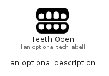

# TeethOpen


```text
fontawesome/Solid/TeethOpen
```

```text
include('fontawesome/Solid/TeethOpen')
```


| Illustration | TeethOpen |
| :---: | :---: |
|  |  |


## Sprites
The item provides the following sriptes:

- `<$TeethOpenXs>`
- `<$TeethOpenSm>`
- `<$TeethOpenMd>`
- `<$TeethOpenLg>`


## TeethOpen

### Load remotely
```plantuml
@startuml
' configures the library
!global $LIB_BASE_LOCATION="https://raw.githubusercontent.com/tmorin/plantuml-libs/master/distribution"

' loads the library's bootstrap
!include $LIB_BASE_LOCATION/bootstrap.puml

' loads the package bootstrap
include('fontawesome/bootstrap')

' loads the Item which embeds the element TeethOpen
include('fontawesome/Solid/TeethOpen')

' renders the element
TeethOpen('TeethOpen', 'Teeth Open', 'an optional tech label', 'an optional description')
@enduml
```

### Load locally
```plantuml
@startuml
' configures the library
!global $INCLUSION_MODE="local"
!global $LIB_BASE_LOCATION="../.."

' loads the library's bootstrap
!include $LIB_BASE_LOCATION/bootstrap.puml

' loads the package bootstrap
include('fontawesome/bootstrap')

' loads the Item which embeds the element TeethOpen
include('fontawesome/Solid/TeethOpen')

' renders the element
TeethOpen('TeethOpen', 'Teeth Open', 'an optional tech label', 'an optional description')
@enduml
```

