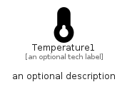

# Temperature1


```text
fontawesome/Solid/Temperature1
```

```text
include('fontawesome/Solid/Temperature1')
```


| Illustration | Temperature1 |
| :---: | :---: |
|  |  |


## Sprites
The item provides the following sriptes:

- `<$Temperature1Xs>`
- `<$Temperature1Sm>`
- `<$Temperature1Md>`
- `<$Temperature1Lg>`


## Temperature1

### Load remotely
```plantuml
@startuml
' configures the library
!global $LIB_BASE_LOCATION="https://raw.githubusercontent.com/tmorin/plantuml-libs/master/distribution"

' loads the library's bootstrap
!include $LIB_BASE_LOCATION/bootstrap.puml

' loads the package bootstrap
include('fontawesome/bootstrap')

' loads the Item which embeds the element Temperature1
include('fontawesome/Solid/Temperature1')

' renders the element
Temperature1('Temperature1', 'Temperature1', 'an optional tech label', 'an optional description')
@enduml
```

### Load locally
```plantuml
@startuml
' configures the library
!global $INCLUSION_MODE="local"
!global $LIB_BASE_LOCATION="../.."

' loads the library's bootstrap
!include $LIB_BASE_LOCATION/bootstrap.puml

' loads the package bootstrap
include('fontawesome/bootstrap')

' loads the Item which embeds the element Temperature1
include('fontawesome/Solid/Temperature1')

' renders the element
Temperature1('Temperature1', 'Temperature1', 'an optional tech label', 'an optional description')
@enduml
```

