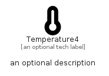

# Temperature4


```text
fontawesome/Solid/Temperature4
```

```text
include('fontawesome/Solid/Temperature4')
```


| Illustration | Temperature4 |
| :---: | :---: |
|  |  |


## Sprites
The item provides the following sriptes:

- `<$Temperature4Xs>`
- `<$Temperature4Sm>`
- `<$Temperature4Md>`
- `<$Temperature4Lg>`


## Temperature4

### Load remotely
```plantuml
@startuml
' configures the library
!global $LIB_BASE_LOCATION="https://raw.githubusercontent.com/tmorin/plantuml-libs/master/distribution"

' loads the library's bootstrap
!include $LIB_BASE_LOCATION/bootstrap.puml

' loads the package bootstrap
include('fontawesome/bootstrap')

' loads the Item which embeds the element Temperature4
include('fontawesome/Solid/Temperature4')

' renders the element
Temperature4('Temperature4', 'Temperature4', 'an optional tech label', 'an optional description')
@enduml
```

### Load locally
```plantuml
@startuml
' configures the library
!global $INCLUSION_MODE="local"
!global $LIB_BASE_LOCATION="../.."

' loads the library's bootstrap
!include $LIB_BASE_LOCATION/bootstrap.puml

' loads the package bootstrap
include('fontawesome/bootstrap')

' loads the Item which embeds the element Temperature4
include('fontawesome/Solid/Temperature4')

' renders the element
Temperature4('Temperature4', 'Temperature4', 'an optional tech label', 'an optional description')
@enduml
```

