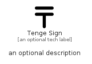

# TengeSign


```text
fontawesome/Solid/TengeSign
```

```text
include('fontawesome/Solid/TengeSign')
```


| Illustration | TengeSign |
| :---: | :---: |
|  |  |


## Sprites
The item provides the following sriptes:

- `<$TengeSignXs>`
- `<$TengeSignSm>`
- `<$TengeSignMd>`
- `<$TengeSignLg>`


## TengeSign

### Load remotely
```plantuml
@startuml
' configures the library
!global $LIB_BASE_LOCATION="https://raw.githubusercontent.com/tmorin/plantuml-libs/master/distribution"

' loads the library's bootstrap
!include $LIB_BASE_LOCATION/bootstrap.puml

' loads the package bootstrap
include('fontawesome/bootstrap')

' loads the Item which embeds the element TengeSign
include('fontawesome/Solid/TengeSign')

' renders the element
TengeSign('TengeSign', 'Tenge Sign', 'an optional tech label', 'an optional description')
@enduml
```

### Load locally
```plantuml
@startuml
' configures the library
!global $INCLUSION_MODE="local"
!global $LIB_BASE_LOCATION="../.."

' loads the library's bootstrap
!include $LIB_BASE_LOCATION/bootstrap.puml

' loads the package bootstrap
include('fontawesome/bootstrap')

' loads the Item which embeds the element TengeSign
include('fontawesome/Solid/TengeSign')

' renders the element
TengeSign('TengeSign', 'Tenge Sign', 'an optional tech label', 'an optional description')
@enduml
```

