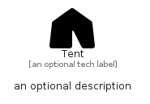

# Tent


```text
fontawesome/Solid/Tent
```

```text
include('fontawesome/Solid/Tent')
```


| Illustration | Tent |
| :---: | :---: |
|  |  |


## Sprites
The item provides the following sriptes:

- `<$TentXs>`
- `<$TentSm>`
- `<$TentMd>`
- `<$TentLg>`


## Tent

### Load remotely
```plantuml
@startuml
' configures the library
!global $LIB_BASE_LOCATION="https://raw.githubusercontent.com/tmorin/plantuml-libs/master/distribution"

' loads the library's bootstrap
!include $LIB_BASE_LOCATION/bootstrap.puml

' loads the package bootstrap
include('fontawesome/bootstrap')

' loads the Item which embeds the element Tent
include('fontawesome/Solid/Tent')

' renders the element
Tent('Tent', 'Tent', 'an optional tech label', 'an optional description')
@enduml
```

### Load locally
```plantuml
@startuml
' configures the library
!global $INCLUSION_MODE="local"
!global $LIB_BASE_LOCATION="../.."

' loads the library's bootstrap
!include $LIB_BASE_LOCATION/bootstrap.puml

' loads the package bootstrap
include('fontawesome/bootstrap')

' loads the Item which embeds the element Tent
include('fontawesome/Solid/Tent')

' renders the element
Tent('Tent', 'Tent', 'an optional tech label', 'an optional description')
@enduml
```

