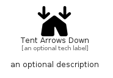

# TentArrowsDown


```text
fontawesome/Solid/TentArrowsDown
```

```text
include('fontawesome/Solid/TentArrowsDown')
```


| Illustration | TentArrowsDown |
| :---: | :---: |
|  |  |


## Sprites
The item provides the following sriptes:

- `<$TentArrowsDownXs>`
- `<$TentArrowsDownSm>`
- `<$TentArrowsDownMd>`
- `<$TentArrowsDownLg>`


## TentArrowsDown

### Load remotely
```plantuml
@startuml
' configures the library
!global $LIB_BASE_LOCATION="https://raw.githubusercontent.com/tmorin/plantuml-libs/master/distribution"

' loads the library's bootstrap
!include $LIB_BASE_LOCATION/bootstrap.puml

' loads the package bootstrap
include('fontawesome/bootstrap')

' loads the Item which embeds the element TentArrowsDown
include('fontawesome/Solid/TentArrowsDown')

' renders the element
TentArrowsDown('TentArrowsDown', 'Tent Arrows Down', 'an optional tech label', 'an optional description')
@enduml
```

### Load locally
```plantuml
@startuml
' configures the library
!global $INCLUSION_MODE="local"
!global $LIB_BASE_LOCATION="../.."

' loads the library's bootstrap
!include $LIB_BASE_LOCATION/bootstrap.puml

' loads the package bootstrap
include('fontawesome/bootstrap')

' loads the Item which embeds the element TentArrowsDown
include('fontawesome/Solid/TentArrowsDown')

' renders the element
TentArrowsDown('TentArrowsDown', 'Tent Arrows Down', 'an optional tech label', 'an optional description')
@enduml
```

