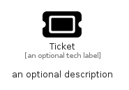

# Ticket


```text
fontawesome/Solid/Ticket
```

```text
include('fontawesome/Solid/Ticket')
```


| Illustration | Ticket |
| :---: | :---: |
|  |  |


## Sprites
The item provides the following sriptes:

- `<$TicketXs>`
- `<$TicketSm>`
- `<$TicketMd>`
- `<$TicketLg>`


## Ticket

### Load remotely
```plantuml
@startuml
' configures the library
!global $LIB_BASE_LOCATION="https://raw.githubusercontent.com/tmorin/plantuml-libs/master/distribution"

' loads the library's bootstrap
!include $LIB_BASE_LOCATION/bootstrap.puml

' loads the package bootstrap
include('fontawesome/bootstrap')

' loads the Item which embeds the element Ticket
include('fontawesome/Solid/Ticket')

' renders the element
Ticket('Ticket', 'Ticket', 'an optional tech label', 'an optional description')
@enduml
```

### Load locally
```plantuml
@startuml
' configures the library
!global $INCLUSION_MODE="local"
!global $LIB_BASE_LOCATION="../.."

' loads the library's bootstrap
!include $LIB_BASE_LOCATION/bootstrap.puml

' loads the package bootstrap
include('fontawesome/bootstrap')

' loads the Item which embeds the element Ticket
include('fontawesome/Solid/Ticket')

' renders the element
Ticket('Ticket', 'Ticket', 'an optional tech label', 'an optional description')
@enduml
```

