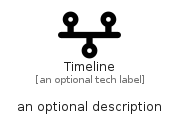

# Timeline


```text
fontawesome/Solid/Timeline
```

```text
include('fontawesome/Solid/Timeline')
```


| Illustration | Timeline |
| :---: | :---: |
|  |  |


## Sprites
The item provides the following sriptes:

- `<$TimelineXs>`
- `<$TimelineSm>`
- `<$TimelineMd>`
- `<$TimelineLg>`


## Timeline

### Load remotely
```plantuml
@startuml
' configures the library
!global $LIB_BASE_LOCATION="https://raw.githubusercontent.com/tmorin/plantuml-libs/master/distribution"

' loads the library's bootstrap
!include $LIB_BASE_LOCATION/bootstrap.puml

' loads the package bootstrap
include('fontawesome/bootstrap')

' loads the Item which embeds the element Timeline
include('fontawesome/Solid/Timeline')

' renders the element
Timeline('Timeline', 'Timeline', 'an optional tech label', 'an optional description')
@enduml
```

### Load locally
```plantuml
@startuml
' configures the library
!global $INCLUSION_MODE="local"
!global $LIB_BASE_LOCATION="../.."

' loads the library's bootstrap
!include $LIB_BASE_LOCATION/bootstrap.puml

' loads the package bootstrap
include('fontawesome/bootstrap')

' loads the Item which embeds the element Timeline
include('fontawesome/Solid/Timeline')

' renders the element
Timeline('Timeline', 'Timeline', 'an optional tech label', 'an optional description')
@enduml
```

