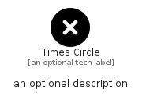

# TimesCircle


```text
fontawesome/Solid/TimesCircle
```

```text
include('fontawesome/Solid/TimesCircle')
```


| Illustration | TimesCircle |
| :---: | :---: |
|  |  |


## Sprites
The item provides the following sriptes:

- `<$TimesCircleXs>`
- `<$TimesCircleSm>`
- `<$TimesCircleMd>`
- `<$TimesCircleLg>`


## TimesCircle

### Load remotely
```plantuml
@startuml
' configures the library
!global $LIB_BASE_LOCATION="https://raw.githubusercontent.com/tmorin/plantuml-libs/master/distribution"

' loads the library's bootstrap
!include $LIB_BASE_LOCATION/bootstrap.puml

' loads the package bootstrap
include('fontawesome/bootstrap')

' loads the Item which embeds the element TimesCircle
include('fontawesome/Solid/TimesCircle')

' renders the element
TimesCircle('TimesCircle', 'Times Circle', 'an optional tech label', 'an optional description')
@enduml
```

### Load locally
```plantuml
@startuml
' configures the library
!global $INCLUSION_MODE="local"
!global $LIB_BASE_LOCATION="../.."

' loads the library's bootstrap
!include $LIB_BASE_LOCATION/bootstrap.puml

' loads the package bootstrap
include('fontawesome/bootstrap')

' loads the Item which embeds the element TimesCircle
include('fontawesome/Solid/TimesCircle')

' renders the element
TimesCircle('TimesCircle', 'Times Circle', 'an optional tech label', 'an optional description')
@enduml
```

