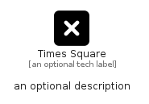

# TimesSquare


```text
fontawesome/Solid/TimesSquare
```

```text
include('fontawesome/Solid/TimesSquare')
```


| Illustration | TimesSquare |
| :---: | :---: |
|  |  |


## Sprites
The item provides the following sriptes:

- `<$TimesSquareXs>`
- `<$TimesSquareSm>`
- `<$TimesSquareMd>`
- `<$TimesSquareLg>`


## TimesSquare

### Load remotely
```plantuml
@startuml
' configures the library
!global $LIB_BASE_LOCATION="https://raw.githubusercontent.com/tmorin/plantuml-libs/master/distribution"

' loads the library's bootstrap
!include $LIB_BASE_LOCATION/bootstrap.puml

' loads the package bootstrap
include('fontawesome/bootstrap')

' loads the Item which embeds the element TimesSquare
include('fontawesome/Solid/TimesSquare')

' renders the element
TimesSquare('TimesSquare', 'Times Square', 'an optional tech label', 'an optional description')
@enduml
```

### Load locally
```plantuml
@startuml
' configures the library
!global $INCLUSION_MODE="local"
!global $LIB_BASE_LOCATION="../.."

' loads the library's bootstrap
!include $LIB_BASE_LOCATION/bootstrap.puml

' loads the package bootstrap
include('fontawesome/bootstrap')

' loads the Item which embeds the element TimesSquare
include('fontawesome/Solid/TimesSquare')

' renders the element
TimesSquare('TimesSquare', 'Times Square', 'an optional tech label', 'an optional description')
@enduml
```

