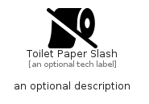

# ToiletPaperSlash


```text
fontawesome/Solid/ToiletPaperSlash
```

```text
include('fontawesome/Solid/ToiletPaperSlash')
```


| Illustration | ToiletPaperSlash |
| :---: | :---: |
|  |  |


## Sprites
The item provides the following sriptes:

- `<$ToiletPaperSlashXs>`
- `<$ToiletPaperSlashSm>`
- `<$ToiletPaperSlashMd>`
- `<$ToiletPaperSlashLg>`


## ToiletPaperSlash

### Load remotely
```plantuml
@startuml
' configures the library
!global $LIB_BASE_LOCATION="https://raw.githubusercontent.com/tmorin/plantuml-libs/master/distribution"

' loads the library's bootstrap
!include $LIB_BASE_LOCATION/bootstrap.puml

' loads the package bootstrap
include('fontawesome/bootstrap')

' loads the Item which embeds the element ToiletPaperSlash
include('fontawesome/Solid/ToiletPaperSlash')

' renders the element
ToiletPaperSlash('ToiletPaperSlash', 'Toilet Paper Slash', 'an optional tech label', 'an optional description')
@enduml
```

### Load locally
```plantuml
@startuml
' configures the library
!global $INCLUSION_MODE="local"
!global $LIB_BASE_LOCATION="../.."

' loads the library's bootstrap
!include $LIB_BASE_LOCATION/bootstrap.puml

' loads the package bootstrap
include('fontawesome/bootstrap')

' loads the Item which embeds the element ToiletPaperSlash
include('fontawesome/Solid/ToiletPaperSlash')

' renders the element
ToiletPaperSlash('ToiletPaperSlash', 'Toilet Paper Slash', 'an optional tech label', 'an optional description')
@enduml
```

