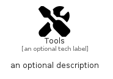

# Tools


```text
fontawesome/Solid/Tools
```

```text
include('fontawesome/Solid/Tools')
```


| Illustration | Tools |
| :---: | :---: |
|  |  |


## Sprites
The item provides the following sriptes:

- `<$ToolsXs>`
- `<$ToolsSm>`
- `<$ToolsMd>`
- `<$ToolsLg>`


## Tools

### Load remotely
```plantuml
@startuml
' configures the library
!global $LIB_BASE_LOCATION="https://raw.githubusercontent.com/tmorin/plantuml-libs/master/distribution"

' loads the library's bootstrap
!include $LIB_BASE_LOCATION/bootstrap.puml

' loads the package bootstrap
include('fontawesome/bootstrap')

' loads the Item which embeds the element Tools
include('fontawesome/Solid/Tools')

' renders the element
Tools('Tools', 'Tools', 'an optional tech label', 'an optional description')
@enduml
```

### Load locally
```plantuml
@startuml
' configures the library
!global $INCLUSION_MODE="local"
!global $LIB_BASE_LOCATION="../.."

' loads the library's bootstrap
!include $LIB_BASE_LOCATION/bootstrap.puml

' loads the package bootstrap
include('fontawesome/bootstrap')

' loads the Item which embeds the element Tools
include('fontawesome/Solid/Tools')

' renders the element
Tools('Tools', 'Tools', 'an optional tech label', 'an optional description')
@enduml
```

