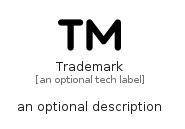

# Trademark


```text
fontawesome/Solid/Trademark
```

```text
include('fontawesome/Solid/Trademark')
```


| Illustration | Trademark |
| :---: | :---: |
|  |  |


## Sprites
The item provides the following sriptes:

- `<$TrademarkXs>`
- `<$TrademarkSm>`
- `<$TrademarkMd>`
- `<$TrademarkLg>`


## Trademark

### Load remotely
```plantuml
@startuml
' configures the library
!global $LIB_BASE_LOCATION="https://raw.githubusercontent.com/tmorin/plantuml-libs/master/distribution"

' loads the library's bootstrap
!include $LIB_BASE_LOCATION/bootstrap.puml

' loads the package bootstrap
include('fontawesome/bootstrap')

' loads the Item which embeds the element Trademark
include('fontawesome/Solid/Trademark')

' renders the element
Trademark('Trademark', 'Trademark', 'an optional tech label', 'an optional description')
@enduml
```

### Load locally
```plantuml
@startuml
' configures the library
!global $INCLUSION_MODE="local"
!global $LIB_BASE_LOCATION="../.."

' loads the library's bootstrap
!include $LIB_BASE_LOCATION/bootstrap.puml

' loads the package bootstrap
include('fontawesome/bootstrap')

' loads the Item which embeds the element Trademark
include('fontawesome/Solid/Trademark')

' renders the element
Trademark('Trademark', 'Trademark', 'an optional tech label', 'an optional description')
@enduml
```

