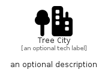

# TreeCity


```text
fontawesome/Solid/TreeCity
```

```text
include('fontawesome/Solid/TreeCity')
```


| Illustration | TreeCity |
| :---: | :---: |
|  |  |


## Sprites
The item provides the following sriptes:

- `<$TreeCityXs>`
- `<$TreeCitySm>`
- `<$TreeCityMd>`
- `<$TreeCityLg>`


## TreeCity

### Load remotely
```plantuml
@startuml
' configures the library
!global $LIB_BASE_LOCATION="https://raw.githubusercontent.com/tmorin/plantuml-libs/master/distribution"

' loads the library's bootstrap
!include $LIB_BASE_LOCATION/bootstrap.puml

' loads the package bootstrap
include('fontawesome/bootstrap')

' loads the Item which embeds the element TreeCity
include('fontawesome/Solid/TreeCity')

' renders the element
TreeCity('TreeCity', 'Tree City', 'an optional tech label', 'an optional description')
@enduml
```

### Load locally
```plantuml
@startuml
' configures the library
!global $INCLUSION_MODE="local"
!global $LIB_BASE_LOCATION="../.."

' loads the library's bootstrap
!include $LIB_BASE_LOCATION/bootstrap.puml

' loads the package bootstrap
include('fontawesome/bootstrap')

' loads the Item which embeds the element TreeCity
include('fontawesome/Solid/TreeCity')

' renders the element
TreeCity('TreeCity', 'Tree City', 'an optional tech label', 'an optional description')
@enduml
```

