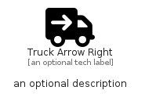

# TruckArrowRight


```text
fontawesome/Solid/TruckArrowRight
```

```text
include('fontawesome/Solid/TruckArrowRight')
```


| Illustration | TruckArrowRight |
| :---: | :---: |
|  |  |


## Sprites
The item provides the following sriptes:

- `<$TruckArrowRightXs>`
- `<$TruckArrowRightSm>`
- `<$TruckArrowRightMd>`
- `<$TruckArrowRightLg>`


## TruckArrowRight

### Load remotely
```plantuml
@startuml
' configures the library
!global $LIB_BASE_LOCATION="https://raw.githubusercontent.com/tmorin/plantuml-libs/master/distribution"

' loads the library's bootstrap
!include $LIB_BASE_LOCATION/bootstrap.puml

' loads the package bootstrap
include('fontawesome/bootstrap')

' loads the Item which embeds the element TruckArrowRight
include('fontawesome/Solid/TruckArrowRight')

' renders the element
TruckArrowRight('TruckArrowRight', 'Truck Arrow Right', 'an optional tech label', 'an optional description')
@enduml
```

### Load locally
```plantuml
@startuml
' configures the library
!global $INCLUSION_MODE="local"
!global $LIB_BASE_LOCATION="../.."

' loads the library's bootstrap
!include $LIB_BASE_LOCATION/bootstrap.puml

' loads the package bootstrap
include('fontawesome/bootstrap')

' loads the Item which embeds the element TruckArrowRight
include('fontawesome/Solid/TruckArrowRight')

' renders the element
TruckArrowRight('TruckArrowRight', 'Truck Arrow Right', 'an optional tech label', 'an optional description')
@enduml
```

