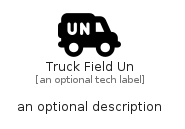

# TruckFieldUn


```text
fontawesome/Solid/TruckFieldUn
```

```text
include('fontawesome/Solid/TruckFieldUn')
```


| Illustration | TruckFieldUn |
| :---: | :---: |
|  |  |


## Sprites
The item provides the following sriptes:

- `<$TruckFieldUnXs>`
- `<$TruckFieldUnSm>`
- `<$TruckFieldUnMd>`
- `<$TruckFieldUnLg>`


## TruckFieldUn

### Load remotely
```plantuml
@startuml
' configures the library
!global $LIB_BASE_LOCATION="https://raw.githubusercontent.com/tmorin/plantuml-libs/master/distribution"

' loads the library's bootstrap
!include $LIB_BASE_LOCATION/bootstrap.puml

' loads the package bootstrap
include('fontawesome/bootstrap')

' loads the Item which embeds the element TruckFieldUn
include('fontawesome/Solid/TruckFieldUn')

' renders the element
TruckFieldUn('TruckFieldUn', 'Truck Field Un', 'an optional tech label', 'an optional description')
@enduml
```

### Load locally
```plantuml
@startuml
' configures the library
!global $INCLUSION_MODE="local"
!global $LIB_BASE_LOCATION="../.."

' loads the library's bootstrap
!include $LIB_BASE_LOCATION/bootstrap.puml

' loads the package bootstrap
include('fontawesome/bootstrap')

' loads the Item which embeds the element TruckFieldUn
include('fontawesome/Solid/TruckFieldUn')

' renders the element
TruckFieldUn('TruckFieldUn', 'Truck Field Un', 'an optional tech label', 'an optional description')
@enduml
```

