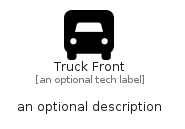

# TruckFront


```text
fontawesome/Solid/TruckFront
```

```text
include('fontawesome/Solid/TruckFront')
```


| Illustration | TruckFront |
| :---: | :---: |
|  |  |


## Sprites
The item provides the following sriptes:

- `<$TruckFrontXs>`
- `<$TruckFrontSm>`
- `<$TruckFrontMd>`
- `<$TruckFrontLg>`


## TruckFront

### Load remotely
```plantuml
@startuml
' configures the library
!global $LIB_BASE_LOCATION="https://raw.githubusercontent.com/tmorin/plantuml-libs/master/distribution"

' loads the library's bootstrap
!include $LIB_BASE_LOCATION/bootstrap.puml

' loads the package bootstrap
include('fontawesome/bootstrap')

' loads the Item which embeds the element TruckFront
include('fontawesome/Solid/TruckFront')

' renders the element
TruckFront('TruckFront', 'Truck Front', 'an optional tech label', 'an optional description')
@enduml
```

### Load locally
```plantuml
@startuml
' configures the library
!global $INCLUSION_MODE="local"
!global $LIB_BASE_LOCATION="../.."

' loads the library's bootstrap
!include $LIB_BASE_LOCATION/bootstrap.puml

' loads the package bootstrap
include('fontawesome/bootstrap')

' loads the Item which embeds the element TruckFront
include('fontawesome/Solid/TruckFront')

' renders the element
TruckFront('TruckFront', 'Truck Front', 'an optional tech label', 'an optional description')
@enduml
```

