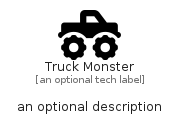

# TruckMonster


```text
fontawesome/Solid/TruckMonster
```

```text
include('fontawesome/Solid/TruckMonster')
```


| Illustration | TruckMonster |
| :---: | :---: |
|  |  |


## Sprites
The item provides the following sriptes:

- `<$TruckMonsterXs>`
- `<$TruckMonsterSm>`
- `<$TruckMonsterMd>`
- `<$TruckMonsterLg>`


## TruckMonster

### Load remotely
```plantuml
@startuml
' configures the library
!global $LIB_BASE_LOCATION="https://raw.githubusercontent.com/tmorin/plantuml-libs/master/distribution"

' loads the library's bootstrap
!include $LIB_BASE_LOCATION/bootstrap.puml

' loads the package bootstrap
include('fontawesome/bootstrap')

' loads the Item which embeds the element TruckMonster
include('fontawesome/Solid/TruckMonster')

' renders the element
TruckMonster('TruckMonster', 'Truck Monster', 'an optional tech label', 'an optional description')
@enduml
```

### Load locally
```plantuml
@startuml
' configures the library
!global $INCLUSION_MODE="local"
!global $LIB_BASE_LOCATION="../.."

' loads the library's bootstrap
!include $LIB_BASE_LOCATION/bootstrap.puml

' loads the package bootstrap
include('fontawesome/bootstrap')

' loads the Item which embeds the element TruckMonster
include('fontawesome/Solid/TruckMonster')

' renders the element
TruckMonster('TruckMonster', 'Truck Monster', 'an optional tech label', 'an optional description')
@enduml
```

